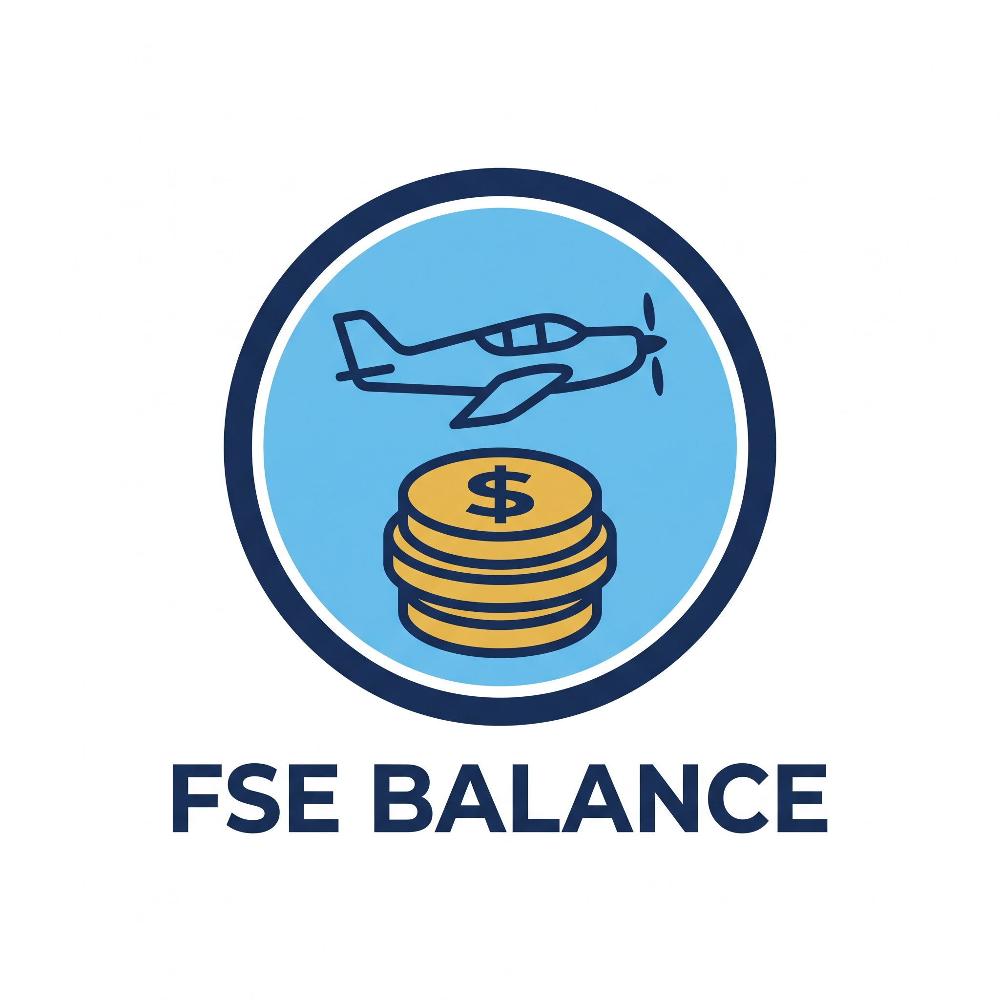

<p align="center">
  
</p>

# FSE Balance — WordPress Plugin for FSEconomy

WordPress plugin to display any account or group bank balance from the [FSEconomy](https://www.fseconomy.net) API using a shortcode.

Instead of querying the FSEconomy API on every page load, the plugin fetches the `Bank_balance` value **automatically every 30 minutes via WP-Cron** and serves the cached value to visitors. This avoids continuous requests, API rate-limit restrictions, and blocks.

## Features

- Displays the FSEconomy bank balance with the `[fse_balance]` shortcode.
- Automatic background sync every 30 minutes (custom WP-Cron interval).
- Cached output: visitors see the stored value, no live API call per visit.
- Overlap lock to prevent concurrent fetches (cron + manual refresh).
- Admin settings page to configure the API URL, force a manual refresh, and check status (last value, last update, next run, last error).
- SSRF protection: only `http/https` URLs on `*.fseconomy.net` with standard ports (80/443) are allowed.
- Safe XML parsing with XXE protection and response size limit.
- Self-hosted updates from GitHub Releases (check every 12 hours, one-click and auto-updates).
- Clean uninstall: removes options, locks, and scheduled events.

## How It Works

1. You configure your FSEconomy API URL in `WP Admin > FSE Balance`.
2. Every 30 minutes, WP-Cron calls the API, parses `Statistic > Bank_balance` from the XML response, and stores it in the database.
3. The `[fse_balance]` shortcode renders the cached value as formatted currency, e.g. `$12,345.67`.

> Note: WP-Cron runs on site visits. On low-traffic sites, set up a real system cron calling `wp-cron.php` every 30 minutes for reliable scheduling.

## Requirements

- WordPress 6.0 or higher
- PHP 7.4 or higher
- A valid FSEconomy API URL

## Installation

1. Go to [**Releases**](https://github.com/leuros88/Balance-Plugin-Wodpress-for-FSEconomy/releases) and download the latest `.zip`.
2. Install it using one of these methods:
   - **Option A — FTP:** extract / upload the plugin folder to `wp-content/plugins/`.
   - **Option B — WP Admin:** go to `Plugins > Add New > Upload Plugin`, upload the `.zip` directly.
3. Go to `Plugins` and click **Activate** on **FSE Balance**.
4. Go to `FSE Balance` in the admin menu and paste your FSEconomy API URL, then click **Save URL**.

## Usage

Add the shortcode anywhere (post, page, widget):

```
[fse_balance]
```

To force an immediate sync, use the **Force update now** button on the settings page.

## Updates

The plugin checks this repository for new versions **every 12 hours** via the GitHub Releases API (`releases/latest`).

- If a new release exists, WordPress shows it in `Dashboard > Updates` and in `Plugins` with one-click update and "View details" (changelog from the release notes).
- To enable fully automatic installation, go to `Plugins` and click **Enable auto-updates** on **FSE Balance**.
- You can force an immediate check from `FSE Balance > Check for updates now` (clears the 12-hour cache and refreshes WordPress update data).
- Releases use tags like `v1.3`. The attached `.zip` must contain the `fse-balance-plugin/` folder; if there is no attached asset, the GitHub `zipball` is used as fallback.

## License

MIT License. Created by **Leuros88**.

See [LICENSE](LICENSE) for details.
